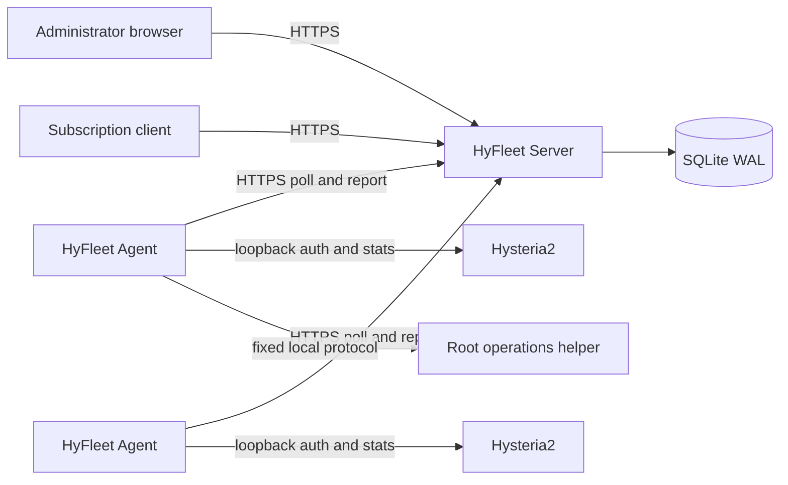

# HyFleet

[](https://github.com/Sen62455/HyFleet/actions/workflows/ci.yml)
[](https://github.com/Sen62455/HyFleet/actions/workflows/release.yml)
[](LICENSE)

HyFleet is a lightweight, self-hosted control plane for small fleets of
Hysteria2 VPS nodes. It centralizes users, node assignments, traffic, unified
subscriptions, host monitoring, alerts, and bounded operations while keeping the
proxy data plane independent from the controller.

HyFleet is designed for personal and small shared fleets running on low-resource
servers. The production stack is a Go Server, an embedded Vue console, SQLite,
and one small outbound-only Agent per node. Redis, PostgreSQL, Kubernetes, and a
message broker are not required.

## Highlights

- Manage global users, expiry, enable state, node assignments, independent
  per-node credentials, and global or per-node traffic limits.
- Authenticate native Hysteria2 users through an Agent-side verifier cache, so a
  temporary controller outage does not interrupt cached authentication.
- Generate rotatable and revocable subscription URLs in Hysteria2 URI, Base64,
  Mihomo/Clash, and sing-box formats.
- Account for upload and download with a durable Agent Outbox and idempotent
  controller aggregation.
- Observe online users, host resources, core status, bounded top-process and
  systemd-service snapshots, alerts, and retained metric history.
- Run allowlisted core probes, restarts, limited log reads, and bounded local
  configuration backups without exposing a remote shell.
- Reconcile desired state asynchronously and surface pending, applied, failed,
  stale, and offline states explicitly.
- Install natively on Debian or Ubuntu, or run only the Server in a hardened
  rootless container. Agents remain native systemd services.
- Build checksum-verified amd64/arm64 releases with SPDX SBOMs and keyless
  Sigstore signatures.

## Architecture



The Server records desired state and never opens an inbound management port on a
node. Each Agent initiates HTTPS requests, applies only a newer revision, keeps
its last valid authentication snapshot locally, and queues traffic or operation
results until the Server acknowledges them.

See the [Chinese project overview](docs/project-overview.zh-CN.md) for the
requirements, technology choices, trust boundaries, data flows, and operational
model.

## Adapter support

| Adapter | Users | Traffic and subscriptions | Operations | Recommended use |
| --- | --- | --- | --- | --- |
| Native Hysteria2 | Fully managed | Fully managed | Supported | New nodes and migrated nodes |
| S-UI v1.5.x | Explicit import and adoption | Managed after adoption | Limited | Migration compatibility |
| Standalone sing-box | Observation only | Not managed | Supported | Temporary migration inventory |

Native Hysteria2 is the preferred steady-state deployment. Compatibility
adapters do not silently adopt or rewrite existing resources. Refer to the
[compatibility matrix](docs/compatibility.md) before onboarding a node.

## Requirements

- HyFleet Server: Debian 12/13 or Ubuntu 24.04 with systemd, on `amd64` or
  `arm64`; Docker Engine with Compose v2 is also supported for the Server only.
- HyFleet Agent: Debian 12/13 or Ubuntu 24.04 with systemd, on `amd64` or
  `arm64`.
- A dedicated HTTPS origin for the control plane. Native installation binds the
  Server to loopback and expects a reverse proxy such as Caddy or Nginx.
- Outbound HTTPS connectivity from every Agent to the Server.
- An existing, independently working proxy core on each node.

## Install

Choose a reviewed release tag and download the bootstrap from that same tag. The
following public-repository workflow intentionally keeps the version explicit:

```bash
VERSION='vX.Y.Z'
curl --fail --location --proto '=https' --tlsv1.2 \
  -o install.sh \
  "https://raw.githubusercontent.com/Sen62455/HyFleet/${VERSION}/install.sh"
less install.sh
sudo bash install.sh server \
  --version "${VERSION}" \
  --public-url https://panel.example.com
```

Complete administrator setup through the HTTPS origin, create a node and its
one-time enrollment Token, then run the same bootstrap on that node:

```bash
sudo bash install.sh agent \
  --version "${VERSION}" \
  --server-url https://panel.example.com \
  --node-name example-node \
  --adapter native-hysteria2 \
  --core-config-path /etc/hysteria/config.yaml
```

Enrollment is interactive so the Token is not placed in shell history. The
bootstrap verifies the external SHA-256 file, every packaged file, the host OS,
and the binary architecture before invoking the native installer.

For a private repository, download releases on an authenticated workstation with
GitHub CLI and upload the verified bundle, or use the fleet updater for an
existing installation. Do not place a GitHub Token on every VPS. Read the
[project overview](docs/project-overview.zh-CN.md) and the
[native cutover runbook](docs/native-cutover-runbook.zh-CN.md) before a
production install, migration, upgrade, or restore.

## Containerized Server

Only the Server is containerized. Configure `docker/.env.example`, then use
[`docker/compose.yaml`](docker/compose.yaml). The image runs as UID/GID 10001,
drops Linux capabilities, uses a read-only root filesystem, and publishes port
8080 on host loopback by default. Do not mount the Docker socket or host `/etc`
into the container.

## Upgrade, backup, and restore

An existing small fleet can be upgraded in parallel from an authenticated
Windows workstation:

```powershell
.\scripts\deploy-fleet.ps1 -Version vX.Y.Z
```

The updater verifies both checksum layers, saves component snapshots, performs
health checks, and restores the previous component when an update fails. Server
upgrades must precede Agent upgrades.

Create a consistent native Server backup with:

```bash
sudo bash deploy/backup-server.sh --output-dir /var/backups/hyfleet
```

The database archive and encryption master key are separate recovery artifacts.
Store both in separate, encrypted off-host locations and run restore drills; a
database without its matching master key cannot recover managed credentials.

## Development

The supported toolchain is Go 1.26, Node.js 22, and pnpm 11.16.

```bash
go mod verify
go test ./...
go vet ./...
pnpm --dir web install --frozen-lockfile
pnpm --dir web typecheck
pnpm --dir web test
pnpm --dir web lint:docs
pnpm --dir web build
```

Build a Linux release bundle from Windows:

```powershell
.\scripts\build-release.ps1 -Architecture amd64 -Version vX.Y.Z
```

Release assets are written to `output/releases/`. Do not deploy a Windows
preview binary to a VPS. See [CONTRIBUTING.md](CONTRIBUTING.md) for contribution
and compatibility expectations.

## Security

HyFleet deliberately does not provide arbitrary command execution, a browser
terminal, SSH key custody, or a general-purpose remote management surface. The
Agent uses a dedicated unprivileged account; its root helper accepts only a fixed
local protocol for allowlisted operations.

Never commit or publish real node addresses, credentials, subscription URLs,
enrollment Tokens, API Tokens, private keys, database files, or unredacted
configurations. Report vulnerabilities through GitHub private vulnerability
reporting as described in [SECURITY.md](SECURITY.md).

## Documentation

Start with the [documentation index](docs/README.md). It separates current
operator and architecture references from historical implementation records.

## Scope

HyFleet targets small self-hosted fleets, not a commercial billing platform or a
general-purpose RMM. Multi-administrator RBAC, payments, VPS purchasing, full OS
patch management, HA controllers, and protocols other than Hysteria2 are outside
the current scope.

## License

Licensed under the [Apache License 2.0](LICENSE).
