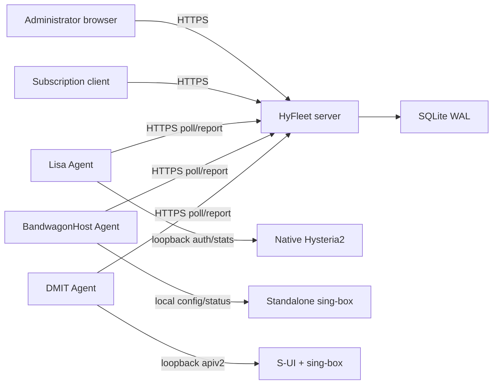

# System Architecture

## 1. Context

HyFleet separates the management control plane from the proxy data plane. Every
managed VPS runs an outbound-only Agent. The proxy core remains Hysteria2 or
sing-box/S-UI and continues to carry traffic without a live controller.



## 2. Control-plane components

### Admin API

Provides versioned REST resources for nodes, users, assignments, traffic,
metrics, subscriptions, audit entries, backups, and allowlisted operations.
Browser authentication uses server-side sessions in secure cookies.

### Reconciler

Builds an immutable desired snapshot for each node. A node revision increases
whenever an assigned user, credential reference/verifier, limit, expiry, or
adapter-owned configuration changes. The reconciler never waits synchronously
for all nodes.

### Agent API

Handles enrollment, heartbeat, desired-state polling, acknowledgements, traffic
batches, metric samples, and operation results. It is separate from the browser
API and has its own protocol version.

### Subscription service

Decrypts each eligible assignment credential only while generating a response,
selects applied endpoints, renders one unified subscription, and redacts tokens
and credential material from logs.

### Scheduler

Runs small in-process jobs for expiry, quota evaluation, stale-node transitions,
metric rollups, retention, backup scheduling, and retry bookkeeping. There is no
external queue in v1.

## 3. Agent components

### Transport

The Agent enrolls once, stores its node credential with mode `0600`, posts a
heartbeat every 15 seconds, and polls desired state every 10 seconds with jitter.
It uses exponential backoff during failure and does not expose a public listener.

### Desired-state cache

The last verified snapshot and its version are stored atomically. The Agent
rejects an older version unless it is accompanied by an explicit signed rollback
operation. A failed apply leaves the previous snapshot active.

### Adapter interface

```text
Probe(ctx) -> capabilities and core health
Discover(ctx) -> existing managed/unmanaged resources
Plan(ctx, desired) -> deterministic changes
Apply(ctx, plan) -> result and applied revision
CollectUsage(ctx) -> per-user counters and online state
Kick(ctx, userID) -> optional result
Operate(ctx, allowlistedOperation) -> result
```

Adapters must be deterministic, idempotent, and unable to mutate resources they
do not own.

### Native Hysteria2 adapter

The Agent hosts a loopback HTTP-auth endpoint. Desired user records are converted
to in-memory verifier entries and persisted in the cache. It never needs the
plaintext assignment credential. The adapter queries the Hysteria2 loopback
Traffic Stats API without `clear=1`, calculates deltas against persisted
baselines, and uses the returned user ID for attribution.

### Standalone sing-box adapter

BandwagonHost is confirmed to run a Hysteria2 inbound in standalone sing-box.
Phase 1 limits this adapter to host/core discovery. User reconciliation remains
disabled until the exact sing-box version, service command, configuration layout,
validation command, reload behavior, and management API capabilities are
inventoried and covered by contract tests. It must use an owned include/fragment
or explicit adoption boundary; it never rewrites an unknown monolithic config.

### S-UI adapter

The Agent calls the S-UI API over loopback. The S-UI token never leaves the VPS.
The adapter records global-user-to-S-UI-client mappings locally. Read-only
discovery precedes any adoption; unmanaged clients remain outside reconciliation.
Because sing-box must store a client password, the Agent retrieves only the
credential bound to its node and current desired revision, passes it to S-UI
during apply, and discards its in-memory copy. Raw material is never part of a
persisted desired snapshot or Agent database.
Discovery responses are decoded into bounded typed structures; password fields
and raw response bodies are never stored, logged, or sent to the controller.

### Metrics and traffic outbox

Host metrics are sampled locally. Traffic deltas and their batch IDs are written
to a durable outbox before sending. A batch is deleted only after the controller
acknowledges that exact ID.

## 4. Principal flows

### Enrollment

1. Administrator creates a node and a short-lived, single-use enrollment token.
2. Agent submits the token, its generated installation ID, version, and
   capabilities over HTTPS.
3. Server consumes the enrollment token and issues a rotatable node credential.
4. Agent stores the credential locally; server retains its long-lived hash.
5. To survive a lost response, an encrypted enrollment result is replayable only
   for the same request/installation during a short window, then erased on the
   first successfully authenticated Agent request or expiry.

### User change

1. Administrator changes a user or assignment in one database transaction.
2. Controller marks affected assignments pending, increments node revisions, and
   derives snapshots; pending endpoints are withheld from subscription output.
3. Agents poll and receive only a newer snapshot.
4. Adapter plans and applies changes, then acknowledges version and result.
5. Controller records the applied credential/version only after acknowledgement.
6. UI shows pending until acknowledgement, and failed with a redacted reason.

### Native authentication

1. Hysteria2 posts `{addr, auth, tx}` to the Agent over loopback.
2. Agent hashes the supplied high-entropy secret and compares in constant time.
3. Agent checks enabled state, expiry, and the last synchronized quota state.
4. Agent returns `{ok: true, id: <global-user-id>}` or a generic denial.

### S-UI credential application

1. The S-UI snapshot names an assignment credential by opaque reference and
   fingerprint but contains no plaintext secret or reusable verifier.
2. Agent requests material for that reference, desired version, and snapshot
   hash using its node credential.
3. Controller verifies the reference belongs to the authenticated S-UI node and
   exact current snapshot, then decrypts only that credential in memory.
4. Agent applies it through the loopback S-UI API and immediately discards it;
   S-UI necessarily retains the node-specific client password.
5. Agent acknowledges the snapshot only after the S-UI state is verified.

### Credential rotation cutover

An assignment stores separate desired and applied credential references. During
rotation the old applied credential remains recoverable while the new credential
is staged, but the endpoint is omitted from newly rendered subscriptions. After
the Agent acknowledges the new snapshot, the controller atomically promotes the
new reference for subscription rendering and retires the old one. Existing
clients must refresh after a default v1 cutover; an overlap window is allowed
only when an adapter advertises and tests dual-credential support.

### Traffic accounting

1. Agent reads cumulative counters and compares them with a durable baseline.
2. Counter decrease or process-instance change starts a new source epoch.
3. Agent stores a UUID batch and per-user deltas in its outbox transactionally.
4. Controller inserts the batch under a unique constraint and updates totals in
   the same transaction.
5. A duplicate batch returns success without changing totals again.

## 5. Failure behavior

| Failure | Required behavior |
| --- | --- |
| Controller unavailable | Agent keeps cached users; changes and reports wait locally |
| Network partition | Node becomes stale/offline; desired revision remains pending |
| Agent restart | Load snapshot, baselines, and outbox before serving auth |
| Agent down on native HY2 | New HTTP auth may fail; systemd must restart Agent immediately |
| Hysteria2 restart | Detect counter reset/new epoch; do not erase controller totals |
| S-UI unavailable | Mark adapter degraded; do not recreate or delete blindly |
| Credential material unavailable | Fail the S-UI apply and preserve prior state |
| Apply failure | Keep previous applied state and report a redacted diagnostic |
| Controller DB loss | Restore encrypted backup plus the external master key |

## 6. Consistency model

Configuration, expiry, and global quota enforcement are eventually consistent.
The UI must expose the last-applied timestamp per node. Traffic ingestion is
at-least-once on the wire and exactly-once in controller accounting through batch
idempotency. Host metrics are best-effort and must never be used for billing.

## 7. Repository layout planned for Phase 1

```text
hyfleet/
  cmd/server/          control-plane entry point
  cmd/agent/           node Agent entry point
  internal/server/     API, auth, reconciliation, subscriptions
  internal/agent/      transport, cache, host metrics, adapters
  internal/protocol/   versioned Agent wire types
  internal/store/      generated sqlc access and migrations
  web/                 Vue source; not needed in production
  docs/                product and engineering documentation
```

## 8. Upstream contract baseline

Phase 0 behavior is based on these upstream materials:

- [S-UI API documentation](https://github.com/alireza0/s-ui/wiki/API-Documentation)
- [Hysteria2 HTTP authentication implementation](https://github.com/apernet/hysteria/blob/master/extras/auth/http.go)
- [Hysteria2 Traffic Stats implementation](https://github.com/apernet/hysteria/blob/master/extras/trafficlogger/http.go)

Moving `master` links are orientation references, not compatibility guarantees.
During implementation, each adapter test fixture must cite a tested released
version and commit. Unknown versions remain read-only or incompatible until their
contract tests pass.
