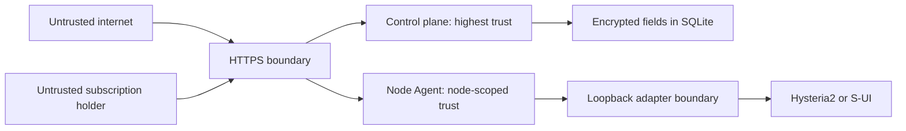

# Security Threat Model

- Status: Phase 0 baseline
- Review trigger: before every release that changes enrollment, credentials,
adapter writes, subscriptions, or node operations

## 1. Security objectives

1. A subscription user cannot access the management API.
2. Compromise of one node does not grant control of other nodes or the server.
3. Loss of a database backup alone does not reveal proxy credentials.
4. A network attacker cannot impersonate an Agent or modify desired state.
5. An adapter cannot mutate resources outside its explicit ownership boundary.
6. Retries and replays cannot double-count traffic or repeat destructive work.
7. The Agent cannot execute an arbitrary command supplied by the controller UI.
8. Secrets never appear in normal logs, audit metadata, metrics, or Git history.

## 2. Assets

- Administrator password and authenticated session.
- Control-plane encryption master key.
- Hysteria2 user credentials and subscription tokens.
- Agent enrollment and long-lived node credentials.
- Local S-UI API token.
- TLS private keys and certificates.
- Desired user state, usage totals, and audit history.
- Integrity and availability of proxy service configuration.

## 3. Trust boundaries and assumptions

- Root compromise of a node exposes that node, its local tokens, and its
  node-specific proxy credentials or verifiers. It must not expose credentials
  usable on other nodes.
- Control-plane compromise can affect every node and reveal decrypted credentials
  while the external master key is available. Hardening the controller is the
  highest priority.
- A VPS provider or kernel-level attacker is outside the protection boundary.
- Traffic reported by a compromised node cannot be proven truthful. HyFleet can
  provide consistency, sanity checks, and attribution, not cryptographic proof of
  bandwidth consumption.

## 4. Threats and required mitigations

| Threat | Impact | Required mitigation |
| --- | --- | --- |
| Admin credential guessing | Fleet takeover | Argon2id, rate limits, lock delay, secure sessions; TOTP after v1 |
| Session theft/CSRF | Unauthorized mutation | HttpOnly Secure SameSite cookie, CSRF token, origin checks, short idle expiry |
| XSS | Session/action theft | Vue escaping, strict CSP, no raw HTML, output encoding |
| SQL injection | Data/secret compromise | Parameterized generated queries; no dynamic SQL fragments from requests |
| Enrollment token theft | Rogue Agent registration | 256-bit token, short expiry, single use, node binding, audit |
| Enrollment response loss/replay | Stranded or duplicated node credential | Request/installation-bound encrypted replay capsule; short TTL; erase after first authenticated use |
| Agent credential theft | Node impersonation | Node-scoped random token, hash at server, rotation/revocation, TLS |
| MITM/downgrade | State modification | Validated TLS, protocol-major negotiation, no insecure production flag |
| Replayed state | Re-enable stale users | Monotonic version, canonical hash, reject rollback without typed authorization |
| Replayed traffic | Double counting | Unique batch ID and transactional idempotency |
| Subscription token leakage | Proxy access | Random opaque token, hash at rest, rotation/revocation, log redaction |
| Database/backup theft | User credential disclosure | XChaCha20-Poly1305 fields; master key outside DB and backup |
| S-UI token leakage | Full local panel control | Token remains in a root-controlled, Agent-readable local file; never sent to server |
| S-UI discovery secret spill | Unmanaged client password disclosure | Bounded typed decoder; discard password fields; never log/forward raw responses |
| Node compromise | Proxy access beyond one node | Independent credential per user-node assignment; node-scoped material authorization |
| Adapter ownership bug | Delete manual clients | Read-only discovery, explicit adoption, dual ownership checks before deletion |
| Arbitrary remote command | Root RCE | Typed allowlist only; Agent has no generic shell/terminal endpoint |
| Local auth spoofing | Unauthorized HY2 access | Loopback bind, unguessable path secret, constant-time verifier comparison |
| Auth CPU exhaustion | Node denial of service | Generated high-entropy passwords + fixed-cost SHA-256 comparison, bounded body |
| Metric/storage flood | Controller exhaustion | Payload/item/interval limits, retention, rate limiting, sanity bounds |
| Secret logging | Persistent disclosure | Typed redaction at source, tests with sentinel secrets, no raw request logging |
| Malicious update | Fleet compromise | Checksums and signed releases before v1.0; no automatic Agent update in MVP |

## 5. Credential design

### Administrator password

Use a versioned Argon2id encoding with parameters measured in Phase 1. Parameters
must be strong enough for the controller while keeping login intentionally
expensive; they are unrelated to node authentication hot paths.

### Hysteria2 credential

Generate an independent secret of at least 32 random bytes for each user-node
assignment and encode it as URL-safe text. The controller encrypts it using
XChaCha20-Poly1305 with a versioned external master key and identity-bound
associated data.

A native Agent receives only `SHA-256(secret)` and compares
`SHA-256(request.auth)` in constant time. An S-UI Agent receives no verifier in
its snapshot; while applying the exact current revision, it may request only its
node-bound plaintext secret and must discard it after the loopback S-UI call.
S-UI necessarily stores that node-specific client password. User-selected weak
credentials are excluded from v1 because a stolen fast verifier would then be
susceptible to offline guessing.

Pre-v1 migration may temporarily import an existing credential only through an
explicit administrator action. The Agent never uploads a discovered password or
raw configuration. Imported weak/shared values are marked for mandatory rotation
before the v1 production gate.

### Subscription token

Generate at least 32 random bytes, store SHA-256 only, and show a small non-secret
prefix for identification. A token is independent of the proxy credential.

### Agent credential

Generate at least 32 random bytes. Store only a password-hash/verifier on the
controller and plaintext in an Agent file readable only by its service account.
Token rotation must overlap safely and be audited. mTLS is a possible later
hardening option, not an MVP prerequisite.

### Master encryption key

Never store it in SQLite, container images, Git, or ordinary backups. Load a
32-byte key from a root-controlled file readable only by the server service
account, or from systemd/container credential injection. Back up the key
separately; losing it makes encrypted user credentials unrecoverable. Key
version supports controlled re-encryption.

## 6. Process privilege model

- `hyfleet-server` runs as a dedicated unprivileged account and cannot manage
  local proxy services unless the same host is separately enrolled as a node.
- `hyfleet-agent` runs as a dedicated account.
- Static configuration/secret files are root-owned and group-readable only by
  the relevant service account. Rotatable node credentials and databases live in
  service-owned state directories with owner-only access.
- Native HTTP auth and stats use unprivileged loopback ports.
- Optional restart uses an exact sudoers rule for a fixed service unit and fixed
  `systemctl` path. No arguments originate from an API string.
- Configuration files containing tokens use owner-only permissions.
- Container deployment uses a read-only root filesystem where practical and
  mounts only the data and master-key paths it requires.

## 7. Web and API baseline

- HTTPS required; HSTS after domain validation.
- Secure, HttpOnly, SameSite=Lax or Strict session cookies.
- State-changing browser requests require CSRF tokens and same-origin validation.
- Strict content security policy; no third-party scripts in the admin UI.
- JSON content type and bounded body size enforced.
- CORS disabled by default.
- Authentication and subscription endpoints rate limited independently.
- Error responses use request IDs and generic public messages.
- API tokens and subscription URLs are removed from query/access logs.

## 8. Security testing gates

- Unit tests for expiry, disabled/quota denial, constant-time verifier path, and
  token redaction.
- Integration tests for replayed enrollment, desired version rollback, duplicate
  batches, adapter ownership, cross-node credential-material denial, and
  controller outage.
- Response-header and sentinel tests proving credential material is not cached,
  persisted in Agent state, or emitted to logs/errors.
- Dependency and secret scanning in CI.
- `go test -race` for stateful Agent and controller packages.
- Fuzz tests for Agent protocol and subscription parsing/rendering.
- Threat model review and documented backup-restore drill before v1.0.

## 9. Responsible disclosure

Before public release, add `SECURITY.md` with supported versions and a private
reporting channel. Public issues must not contain real IPs, subscription URLs,
tokens, configurations, or logs with user identifiers.
